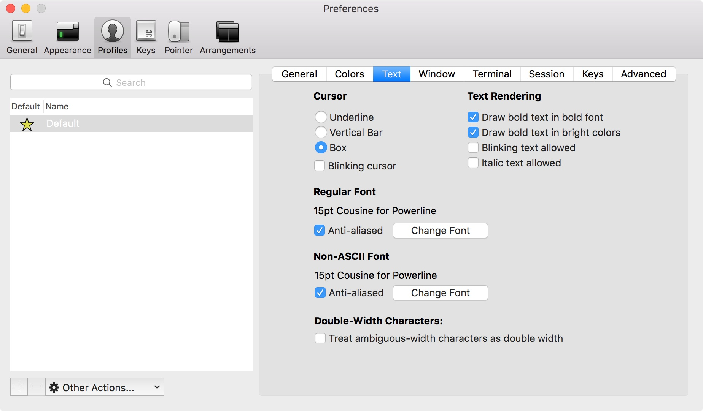

# oh-my-zsh

You'll still need bash for scripting purposes, but I'm digging zsh for interactive shells. The [oh-my-zsh](http://ohmyz.sh) project pulls together themes and plugins for zsh. [Powerline](https://powerline.readthedocs.org) provides statusline for vim and shells.

Read the documentation for lots more details.

## Installation

### zsh

```shell
$ brew install zsh
```

### oh-my-zsh

```shell
$ sh -c "$(curl -fsSL https://raw.github.com/robbyrussell/oh-my-zsh/master/tools/install.sh)"
```

The installer will ask for your password. This is so it can make zsh your default shell. After that's done, kill off your shell.terminal. When you restart it, zsh will be your new default shell.


Read through the `~/.zshrc` file it creates for you. It is well commented and tells you how to change your theme and/or plugins. For instance, you can add the Homebrew plugin to tab completion for `brew` commands.

```shell
# Which plugins would you like to load? (plugins can be found in ~/.oh-my-zsh/plugins/*)
# Custom plugins may be added to ~/.oh-my-zsh/custom/plugins/
# Example format: plugins=(rails git textmate ruby lighthouse)
# Add wisely, as too many plugins slow down shell startup.
plugins=(brew git)
```

Use

```shell
$ source ~.zhrc
```

### Powerline (optional)

To install Powerline, we'll install Python (via Homebrew) first.

```shell
$ brew install python
$ pip install powerline-status
```

To activate Powerline, add the following to your `.zshrc`.

```shell
# powerline
. /usr/local/lib/python2.7/site-packages/powerline/bindings/zsh/powerline.zsh
```

Do `source ~.zhrc` to reload your shell.

Note. Powerline can be used with bash, as well. Read the [documentation](https://powerline.readthedocs.org).

### Powerline Fonts (optional)

In some cases, the fonts you're used to don't work well with Powerline. If that's the case, you can install [patched fonts](https://github.com/powerline/fonts) that will look good and display special characters.

```shell
$ git clone git@github.com:powerline/fonts.git
$ cd fonts
$ ./install.sh
$ cd ..
$ rm -rf fonts  # we no longer need these once their installed
```

Once these fonts are installed, you can use them in your terminal to make sure Powerline looks right.



And the final product ...


